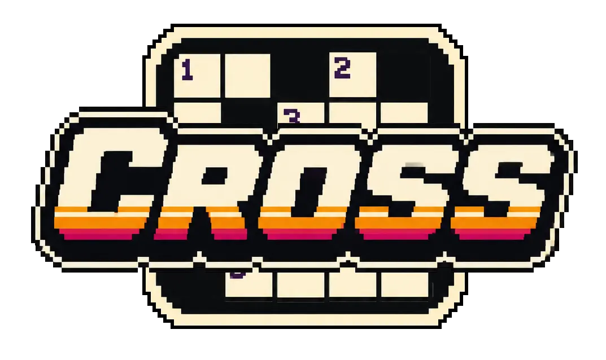

<p align="center">
  
</p>

<p align="center">
  <a href="https://github.com/coyneop/cross/actions/workflows/ci.yml">
    
  </a>
  <a href="https://codecov.io/gh/coyneop/cross">
    
  </a>
</p>

### A crossword rendering library in typescript

Cross is a crossword rendering library with wrappers for **React**, **Svelte**, and **vanilla web
components** — all sharing the same core API.

---

## Install

```bash
npm i @coyneop/cross
```

> Requires **Bun** for development (tests, builds). Consumers can use any Node +
> bundler (esbuild, Vite, Rollup, Webpack).

---

## Usage

### TypeScript / Core

```ts
import { Engine, RenderType } from "@coyneop/cross";

const puzzle = {
  width: 15,
  height: 15,
  cells: [
    // Cell[] — { kind: "block", position } or { kind: "value", position, value }
  ],
  gridIndex: [], // computed automatically
};

const el = document.getElementById("grid")!;
const engine = new Engine(el, puzzle, RenderType.Canvas);

// Listen to user interaction
engine.on("select", (e) => console.log("selected", e.position));
engine.on("keydown", (e) => console.log("letter", e.letter, "at", e.position));

// Swap renderers at runtime
engine.setRenderer(RenderType.Svg);
```

Import paths for tree-shaking:

```ts
import { Engine } from "@coyneop/cross";
// Renderers are bundled together in the core entry.
```

---

### Web Component

Use the `<cross-word>` custom element. It works in any framework (or none).

```html
<cross-word
  id="grid"
  renderer="canvas"
  style="display: block; width: 75%; height: 75%"
></cross-word>

<script type="module">
  import "@coyneop/cross/component/define"; // side-effect: registers <cross-word>

  const board = document.getElementById("grid");

  board.puzzle = {
    width: 15,
    height: 15,
    cells: [
      /* Cell[] */
    ],
    gridIndex: [],
  };

  // Engine events surface as DOM CustomEvents
  board.addEventListener("cross-select", (e) => console.log(e.detail));
  board.addEventListener("cross-keydown", (e) => console.log(e.detail));

  // Switch renderer via attribute
  board.setAttribute("renderer", "svg");
</script>
```

For full control over the tag name:

```ts
import { defineCross } from "@coyneop/cross/component";
defineCross("my-crossword");
```

`renderer` attribute accepts `"html"`, `"canvas"`, `"svg"` (and `"webgpu"` in the future).

---

### React

```tsx
import { Crossword } from "@coyneop/cross/react";
import { RenderType } from "@coyneop/cross";

function App() {
  const [puzzle, setPuzzle] = useState({
    width: 15,
    height: 15,
    cells: [
      /* Cell[] */
    ],
    gridIndex: [],
  });

  return (
    <Crossword
      state={puzzle}
      renderer={RenderType.Canvas}
      style={{ width: "100%", height: "100%" }}
    />
  );
}
```

The `renderer` prop accepts any `RenderType` string. The component handles
mounting, resizing, and cleanup automatically.

---

### Svelte

```svelte
<script lang="ts">
  import Crossword from "@coyneop/cross/svelte";
  import { RenderType } from "@coyneop/cross";

  let puzzle = {
    width: 15,
    height: 15,
    cells: [ /* Cell[] */ ],
    gridIndex: [],
  };

  let renderer = RenderType.Html;
</script>

<Crossword {state} {renderer} class="my-grid" />
```

The component accepts `state` (Puzzle), `renderer` (RenderType), and an optional
`class`. Mount/teardown and resize observation are handled automatically.

---

## Renderers

| Renderer | Import path       | Description                                                             |
| -------- | ----------------- | ----------------------------------------------------------------------- |
| HTML     | `Renderer.Html`   | CSS Grid of `<div>` elements. Best accessibility, inspectable DOM.      |
| Canvas   | `Renderer.Canvas` | 2D canvas via `OffscreenCanvas` + `ImageBitmap`. Smooth, fast repaints. |
| SVG      | `Renderer.Svg`    | SVG with `<rect>` + `<text>` elements. Scales cleanly.                  |

---

## Demos

Each demo is a self-contained HTML page you run with Bun's dev server.

### Vanilla / Core

```bash
bun ./demo/index.html
# Opens at http://localhost:3000
```

### Web Component

```bash
bun ./demo/component.html
```

### React

```bash
bun ./demo/react.html
```

### Svelte

```bash
bun ./demo/svelte.html
```

All demos render a sample 15×15 grid and let you toggle between renderers via
a toolbar in the top-left corner.

---

## Development

```bash
bun install        # install dependencies
bun run check      # typecheck + tests + coverage
bun run build      # build dist/
bun test           # run tests (with happy-dom)
bun test --watch   # watch mode
```
